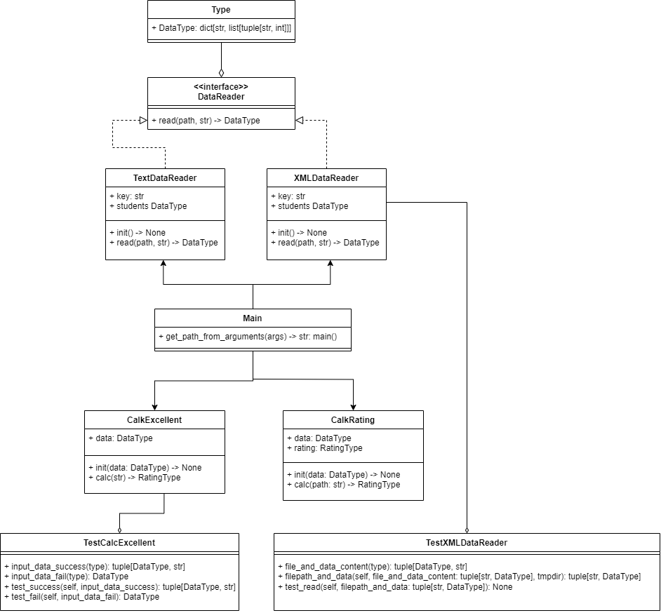

# Лабораторная работа 1 по дисциплине "Технологии программирования"

#### Выполнил: Евдокимов А.Д. САПР-1.4

## Цели

1. Познакомиться c распределенной системой контроля версий кода Git и ее функциями;
2. Познакомиться с понятиями «непрерывная интеграция» (CI) и «непрерывное развертывание» (CD), определить их место в современной разработке программного обеспечения;
3. Получить навыки разработки ООП-программ и написания модульных тестов к ним на современных языках программирования;
4. Получить навыки работы с системой Git для хранения и управления версиями ПО;
5. Получить навыки управления автоматизированным тестированием программного обеспечения, расположенного в системе Git, с помощью инструмента GitHub Actions

## Задачи

1. Выберите для Вашего проекта тип лицензии и добавьте файл с лицензией в проект.
2. Добавьте в проект файл .gitignore и сформируйте его содержимое.
3. Добавьте в проект еще один класс – наследник класса DataReader, который должен
обрабатывать входной файл определенного формата (согласно индивидуальному варианту, см.
таблицу). Составьте модульные тесты для методов этого класса, постарайтесь покрыть тестами
максимально возможный объем кода. Для работы с этим заданием создайте новую ветку кода на основе
главной и фиксируйте в нее весь программный код в процессе разработки. Добейтесь выполнения всех
тестов проекта, после чего объедините текущую ветку кода с главной.
4. Добавьте в проект класс, реализующий расчет определенных характеристик студентов
(согласно индивидуальному варианту, см. таблицу). Составьте модульные тесты для методов этого
класса, постарайтесь покрыть тестами максимально возможный объем кода. Для работы с этим
заданием создайте новую ветку кода на основе главной и фиксируйте в нее весь программный код в
процессе разработки. Добейтесь выполнения всех тестов проекта, после чего объедините текущую
ветку кода с главной.
5. Составьте UML-диаграмму классов итогового проекта.
6. Проанализируйте полученные результаты и сделайте выводы.

## Вариант 3

Формат входного файла - XML

Расчетная процедура - Определить и вывести на экран студента, имеющего 100
баллов по всем дисциплинам. Если таких студентов
несколько, нужно вывести любого из них. Если таких
студентов нет, необходимо вывести сообщение об их
отсутствии.

## Описание проекта

В качестве примера в лабораторной работе используется проект, рассчитывающий средний
рейтинг студентов по дисциплинам. Список студентов и полученных ими оценок приводится в
текстовом файле. Проект написан на языке программирования Python 3, модульное тестирование в нем
осуществляется с помощью библиотеки pytest.

## Диаграмма классов

## Выводы
При выполнении лабораторной работы я улучшил свои навыки работы с распределенной 
системой контроля версий кода Git и ее функциями, получил навыки 
работы с системой Git для хранения и управления версиями ПО, получить навыки 
управления автоматизированным тестированием программного обеспечения, 
расположенного в системе Git, с помощью инструмента GitHub Actions.
